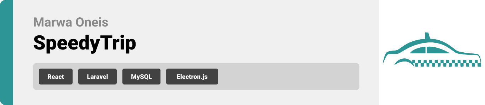
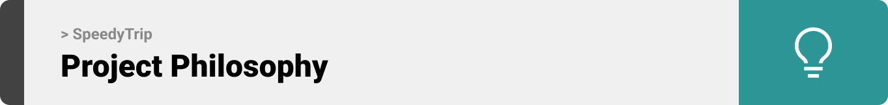
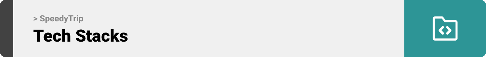
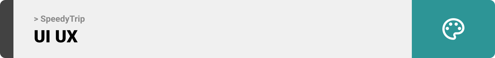

  

<!-- project philosophy -->

> SpeedyTrip is a website project designed to redefine urban mobility by offering a seamless, secure, and user-friendly platform that connects passengers, drivers, and administrators. Leveraging the power of advanced technologies such as React, Laravel, and Electron, SpeedyTrip aims to simplify ride booking, streamline ride management, and equip administrators with powerful tools for oversight. Focused on convenience, safety, and building a sense of community, this website is dedicated to providing a reliable and efficient online transportation solution for everyone involved.

### User Stories

Passenger

- As a passenger, I want to easily request rides from my current location to a desired destination, so that I can travel conveniently.
- As a passenger, I want to view drivers on a map, so I can see how many are available around me.
- As a passenger, I want to communicate with my driver through a chat system, to coordinate pickup details or share additional information.

Driver

- As a driver, I want a user-friendly interface to efficiently manage and respond to ride requests, to maximize my earnings.
- As a driver, I want to be visible on the map to passengers, to increase my chances of getting ride requests.
- As a driver, I want to rate passengers after the ride, to provide feedback on my experience.

Administrator

- As an administrator, I want to approve any new driver sign-ups, to ensure they meet our standards before they can start driving.
- As an administrator, I want to have a dashboard for managing user accounts, to maintain the integrity of the app.
- As an administrator, I want to view ride statistics, to monitor the app's performance and user engagement.

    

<!-- Tech stack -->
 

### MedConnect is built using a combination of modern technologies. Below is an overview of the key technologies employed in the development of MedConnect.

- **Framework**: [React](https://reactjs.org/) is chosen for its component-based architecture, enabling the development of a dynamic and responsive user interface for SpeedyTrip. It facilitates the creation of an intuitive experience for passengers and drivers on the web platform.
- **Framework**: [Laravel](https://laravel.com/) is utilized for its elegant syntax and robust features, which serve as the backbone for the backend of SpeedyTrip. Laravel offers comprehensive tools for authentication, routing, sessions, and caching, making it ideal for building a scalable and secure server-side application.
- **Framework**: [Electron](https://www.electronjs.org/) is integrated to develop the administrative interface of SpeedyTrip, allowing for the creation of a desktop application that runs on multiple operating systems. Electron combines the power of Chromium and Node.js, making it possible to build desktop apps with web technologies.
- **Technology**: [JWT (JSON Web Tokens)](https://jwt.io/) is implemented for authentication in Laravel, providing a secure and efficient way to manage user sessions and API requests. JWT enhances the security of SpeedyTrip by enabling stateless authentication.
- **Database**: [Eloquent ORM](https://laravel.com/docs/5.0/eloquent) is Laravel's native ORM (Object-Relational Mapping) used for database interactions within SpeedyTrip. It simplifies data manipulation and retrieval by allowing expressive and fluent database queries, along with seamless relationships management.
- **Language**: [JavaScript](https://www.javascript.com/) is the primary programming language for SpeedyTrip, powering both the React frontend and the Node.js within Electron's backend. JavaScript's versatility and widespread support make it an ideal choice for this full-stack development project.

  

<!-- UI UX -->

> In designing SpeedyTrip, we started by making detailed mockups. This helped us improve the app's look and feel, making sure it was easy to use and navigate. By constantly updating our designs, we made an app that looks great and works well, offering a top-notch experience for our users.
### Mockups Examples

| Chats Screen                         | Driver Rides Screen                   | Drive Rating Screen                          |
| ----------------------------------- | -------------------------------- | ------------------------------------------------ |
|  | 
 |  |

- Check more mockups on [Figma...](https://www.figma.com/file/zQNJHNBXiV2XQrbJUXJ317/UI%2FUX---Taxi-App?type=design&mode=design&t=CZjVzZw88ynDALH1-1)

  
